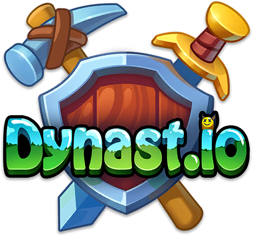

<!-- PROJECT LOGO -->
 

  

  <h3 align="center">Dynast.io Launcher</h3>

  

    A .net framework wpf project for dynast.io game.
     
    <a href="https://discord.gg/GVUXMNv7vV"><strong>Join our discord server »</strong></a>
     
     
    <a href="https://github.com/jalaljaleh/Dynastio.Launcher/issues">Report Bug</a>
    ·
    <a href="https://github.com/jalaljaleh/Dynastio.Launcher/issues">Request Feature</a>
  

  
  

  

<!-- TABLE OF CONTENTS -->
# Dynast.io Launcher
  <ol>
    <li>
      <a href="#road-map">Launcher Roadmap</a>
        </li>
    <li>
      <a href="#about-the-project">About The Project</a>
    </li>
    <li>
      <a href="#getting-started">Getting Started</a>
      <ul>
        <li><a href="#prerequisites">Prerequisites</a></li>
      </ul>
    </li>
    <li><a href="#roadmap">Roadmap</a></li>
    <li><a href="#contributing">Contributing</a></li>
    <li><a href="#license">License</a></li>
    <li><a href="#contact">Contact</a></li>
  </ol>

<!-- Road Map -->
## Roadmap
- [X] Auto Update Game
- [X] Delete Settings 
- [X] Black Name 
- [X] Change Nickname 
- [X] Advanced Change Log

- [ ] Multi-language Support	
    - [X] English, UK
    - [ ] Russian
    - [ ] Ukrainian 

(<a href="#top">back to top</a>)

<!-- ABOUT THE PROJECT -->
## About The Project
...

(<a href="#top">back to top</a>)

<!-- GETTING STARTED -->
## Getting Started
- Meet the prerequisites.
- 
For Developers
- Change config file

### Prerequisites
This is an example of how to list things you need to use the software and how to install them.

- .Net framework 4

### Download
- Donwload from Releases [Download Launcher](https://github.com/JalalJaleh/Dynastio.Launcher/releases)

<!-- CONTRIBUTING -->
## Contributing

Contributions are what make the open source community such an amazing place to learn, inspire, and create. Any contributions you make are **greatly appreciated**.

If you have a suggestion that would make this better, please fork the repo and create a pull request. You can also simply open an issue with the tag "enhancement".

(<a href="#top">back to top</a>)

<!-- LICENSE -->
## License

Distributed under the MIT License. See `LICENSE.txt` for more information.

(<a href="#top">back to top</a>)

<!-- CONTACT -->
## Contact

Jalal Jaleh - jalaljaleh@gmail.com

Project Link: [https://github.com/jalaljaleh/Dynastio.Launcher](https://github.com/jalaljaleh/Dynastio.Launcher)

(<a href="#top">back to top</a>)

